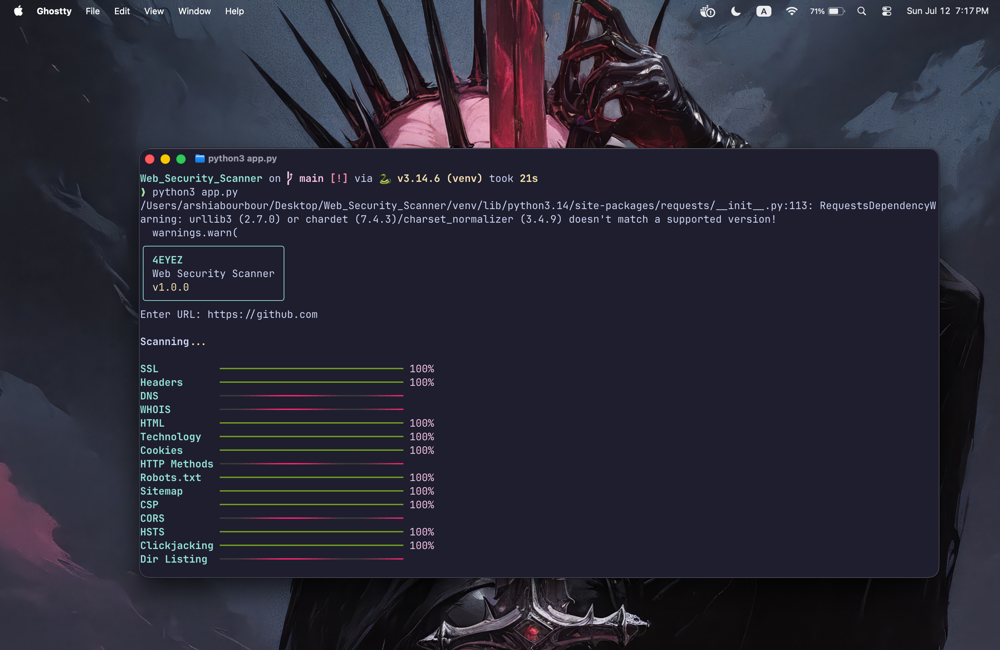
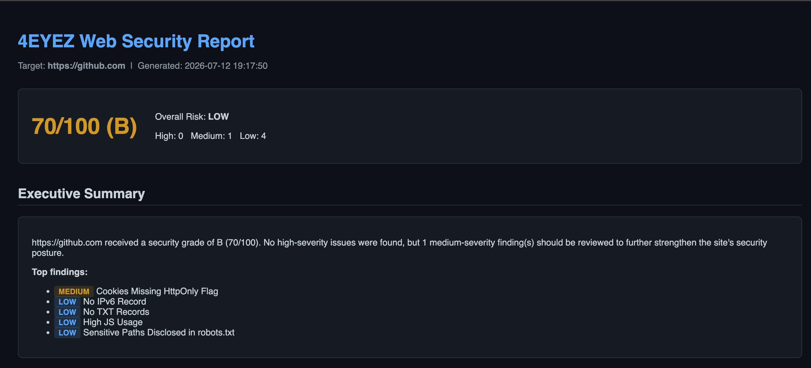
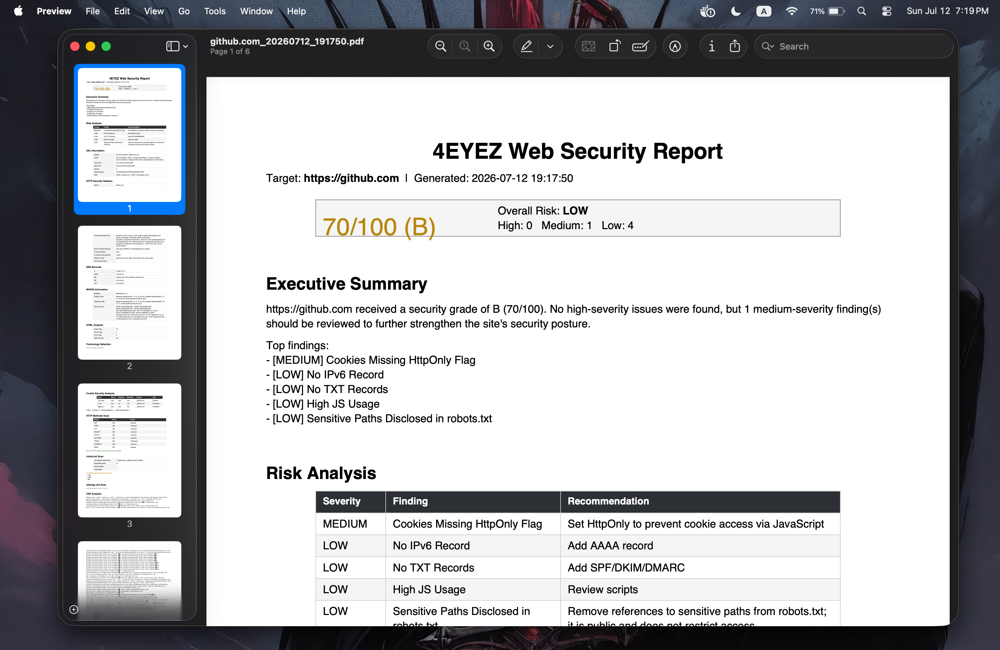

# 🛡️ 4EYEZ – Web Security Scanner

<p align="center">
  <strong>A modular Python-based Web Security Scanner for educational purposes.</strong>
</p>

<p align="center">


</p>

---

## ⚠️ Educational Disclaimer

**4EYEZ** was developed solely for **educational purposes**.

The project demonstrates defensive web security concepts including:

- HTTP Security Headers
- HTTPS Configuration
- CSP / HSTS / CORS Analysis
- Clickjacking Detection
- Sitemap Inspection
- Risk Scoring
- Automated Report Generation

> **This software is intended for learning defensive security techniques only.**
>
> Only scan systems that you own or have explicit authorization to test.

---

# 📚 Table of Contents

- [✨ Features](#-features)
- [📂 Project Structure](#-project-structure)
- [⚡ Quick Start](#-quick-start)
- [🚀 Installation](#-installation)
- [🐳 Docker](#-docker)
- [🐳 Docker Compose](#-docker-compose)
- [🧪 Running Tests](#-running-tests)
- [⚙️ Continuous Integration](#️-continuous-integration)
- [📊 Reports](#-reports)
- [🎬 Demo](#-demo)
- [🖼️ Screenshots](#️-screenshots)
- [🛣️ Roadmap](#️-roadmap)
- [🤝 Contributing](#-contributing)
- [📄 License](#-license)
- [👨‍💻 Author](#-author)

---

# ✨ Features

- Security Header Analysis
- CSP Analysis
- HSTS Analysis
- CORS Analysis
- Clickjacking Detection
- HTTP Methods Inspection
- Sensitive Paths Detection
- Sitemap Analysis
- Executive Summary
- Risk Score Engine
- HTML Report Generation
- PDF Report Generation
- JSON Report Generation
- Docker Support
- Docker Compose Support
- GitHub Actions CI
- 107 Automated Unit Tests

---

# 📂 Project Structure

```text
Web_Security_Scanner/
├── app.py
├── scanner/
├── reports/
├── tests/
├── Dockerfile
├── docker-compose.yml
├── .github/
│   └── workflows/
├── requirements.txt
├── requirements-dev.txt
└── README.md
```

---

# ⚡ Quick Start

```bash
git clone https://github.com/ArshiaBourbour/Web_Security_Scanner.git

cd Web_Security_Scanner

python -m venv venv

source venv/bin/activate

pip install -r requirements-dev.txt

python app.py
```

---

# 🚀 Installation

Follow these steps to install and run the project.

---

## 1️⃣ Clone the repository

```bash
git clone https://github.com/ArshiaBourbour/Web_Security_Scanner.git
```

---

## 2️⃣ Navigate to the project directory

```bash
cd Web_Security_Scanner
```

---

## 3️⃣ Create a virtual environment

### Windows

```powershell
python -m venv venv
```

### macOS / Linux

```bash
python3 -m venv venv
```

---

## 4️⃣ Activate the virtual environment

### Windows (Command Prompt)

```cmd
venv\Scripts\activate.bat
```

### Windows (PowerShell)

```powershell
venv\Scripts\Activate.ps1
```

If PowerShell blocks execution:

```powershell
Set-ExecutionPolicy -ExecutionPolicy RemoteSigned -Scope CurrentUser
```

### macOS / Linux

```bash
source venv/bin/activate
```

---

## 5️⃣ Upgrade pip

```bash
python -m pip install --upgrade pip
```

---

## 6️⃣ Install dependencies

```bash
pip install -r requirements-dev.txt
```

---

## 7️⃣ Run the application

```bash
python app.py
```

---

## 8️⃣ Run the unit tests

```bash
python -m pytest
```

Expected output:

```text
==========================
107 passed
==========================
```

---

# 🐳 Docker

## Build Docker Image

```bash
docker build -t web-security-scanner .
```

## Run Docker Container

```bash
docker run -it web-security-scanner
```

---

# 🐳 Docker Compose

## Start

```bash
docker compose up
```

## Stop

```bash
docker compose down
```

---

# 🧪 Running Tests

Execute all unit tests:

```bash
python -m pytest
```

Current status:

✅ **107 Passing Tests**

---

# ⚙️ Continuous Integration

GitHub Actions automatically:

- Installs dependencies
- Executes the full test suite
- Validates every Push
- Validates every Pull Request

---

# 📊 Reports

The scanner automatically generates reports in multiple formats.

Supported formats:

- HTML
- PDF
- JSON

Generated inside:

```text
reports/
```

---

# 🎬 Demo

<p align="center">

</p>

---

# 🖼️ Screenshots

## Command Line Interface

<p align="center">

</p>

Interactive CLI used to perform security scans.

---

## HTML Report

<p align="center">

</p>

Detailed HTML report with findings and risk analysis.

---

## PDF Report

<p align="center">

</p>

Printable PDF security assessment report.

---

# 🛣️ Roadmap

- [x] Core Scanner
- [x] HTML Report
- [x] PDF Report
- [x] JSON Report
- [x] Risk Engine
- [x] Executive Summary
- [x] Unit Testing
- [x] Docker Support
- [x] Docker Compose
- [x] GitHub Actions
- [x] Version 1.0.0

---

# 🤝 Contributing

Contributions are welcome!

1. Fork the repository.
2. Create a feature branch.
3. Commit your changes.
4. Push your branch.
5. Open a Pull Request.

---

# 📄 License

This project is licensed under the **MIT License**.

---

# 👨‍💻 Author

**Arshia Bourbour**

GitHub:
https://github.com/ArshiaBourbour

---

<p align="center">

⭐ If you found this project useful, please consider giving it a Star!

</p>